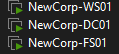
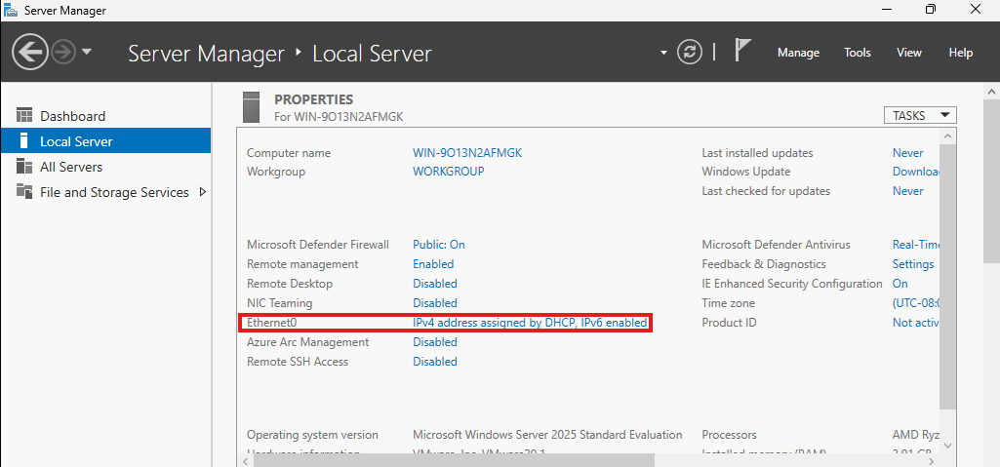
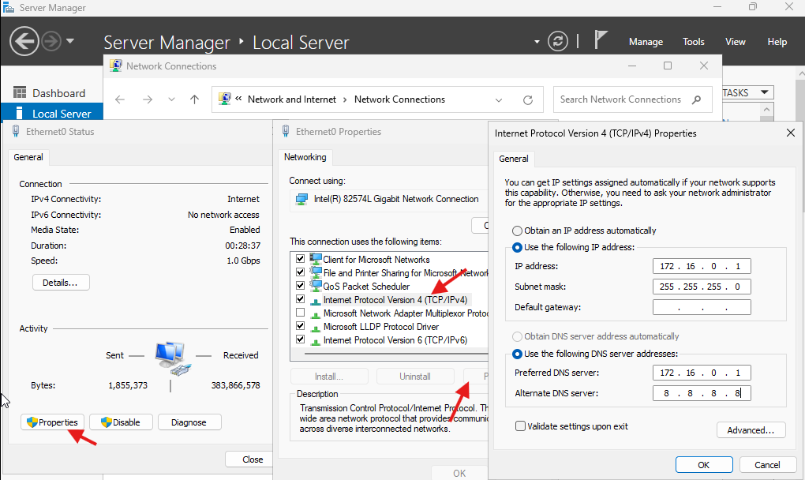
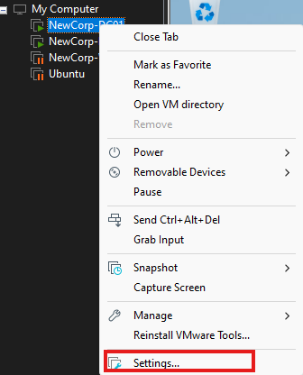
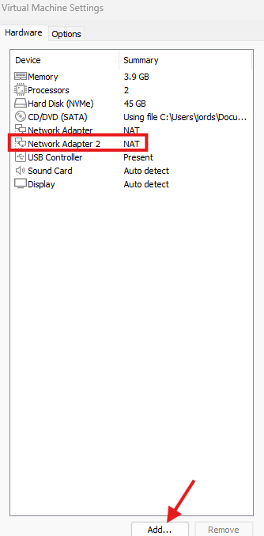
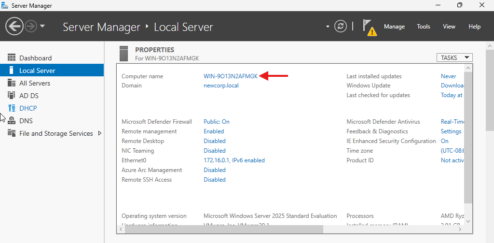
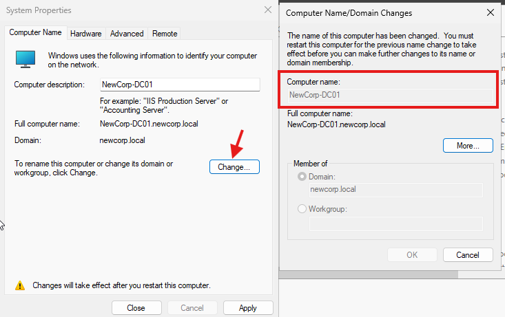
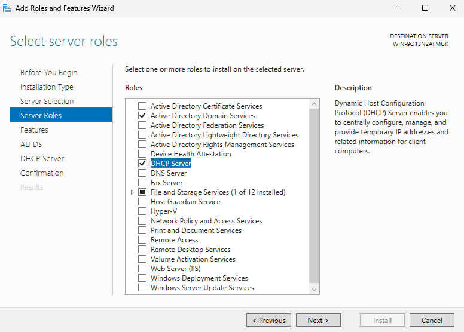
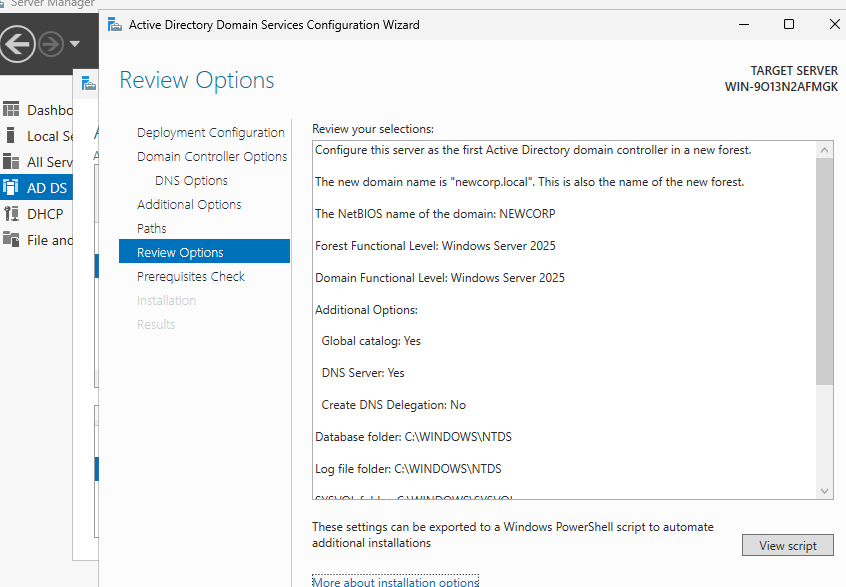
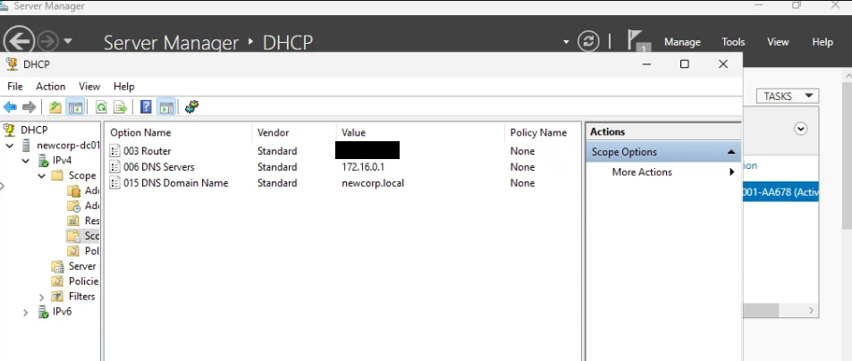

# 🖥️ Prerequisite & Configuring our DC (DC01)

Owner: JECS2025

## 🗂️ Contents
1. [Prerequisite](#-prerequisite)
2. [Configuring DC01](#-configuring-our-domain-controller-dc01)
    - [Set Static IP / DNS Server](#1️⃣-set-a-static-ip--dns-server)
    - [Rename the Computer](#2️⃣-rename-the-computer-to-newcorp-dc01)
    - [Install AD DS & DHCP Role](#3️⃣-install-ad-ds--dhcp-server-role)
    - [Promote to Domain Controller](#4️⃣-promote-dc01-to-a-domain-controller)
    - [Configure DHCP Scope](#5️⃣-configure-dhcp-on-internal-nic)
    - [Verify AD & DNS](#6️⃣-verify-ad--dns)
---
## 🛠️ Prerequisite

1. Download a server ISO – this’ll act as our DC.  
   https://www.microsoft.com/en-us/evalcenter/download-windows-server-2022
2. Download Windows 11 – this’ll represent our end user.  
   https://www.microsoft.com/en-us/software-download/windows11
3. Have a VM.

---

In line with our network diagram we set out, I’ve labelled the relevant servers and workstation. Now let’s begin configuring these!

---

## ⚙️ Configuring our Domain Controller (DC01)

### 1️⃣ Set a Static IP / DNS Server

  
  
  

I’ve got the second Network Adapter added already. However, add it and then set it up with the same process as the Internal NIC.

- External NIC: `Use whatever you connect to the internet on your local machine`  
  *Provides internet access via NAT (Network Address Translation).*

- Internal NIC: `172.16.0.1`  
  *Provides AD, DNS, DHCP to internal devices.*

- Preferred DNS Server: `172.16.0.1`  
  *Internal DNS server for domain services.*

- Alternate DNS Server: `8.8.8.8`  
  *Google DNS as fallback.*

---

### 2️⃣ Rename the Computer to `NewCorp-DC01`

*Use System Properties or Server Manager to rename.*

  

---

### 3️⃣ Install AD DS & DHCP Server Role

- Server Manager → Add Roles and Features  
- Select **Active Directory Domain Services** and **DHCP Server** → Install

---

### 4️⃣ Promote DC01 to a Domain Controller

- Server Manager → **Promote this server to a domain controller**
- Choose **New Forest** → Domain: `newcorp.local`
- Leave DNS defaults
- Set **DSRM password** (for local recovery)
- Restart once complete

---

### 5️⃣ Configure DHCP on Internal NIC

- Server Manager → Tools → **DHCP**
- DHCP Console:
    - Right-click **DC01** under DHCP Servers → **New Scope**
    - Scope Range: `172.16.0.100` to `172.16.0.200`
    - Default Gateway: `172.16.0.1`
    - DNS Server: `172.16.0.1`
- Activate Scope
- Verify **WS01** gets IP in range when using DHCP

*We’ve aligned everything with our network diagram — things are beginning to take shape.*

---

### 6️⃣ Verify AD & DNS

- Open `dsa.msc` → Active Directory Users and Computers
- Open `dnsmgmt.msc` → DNS Manager  
  Verify `newcorp.local` exists

