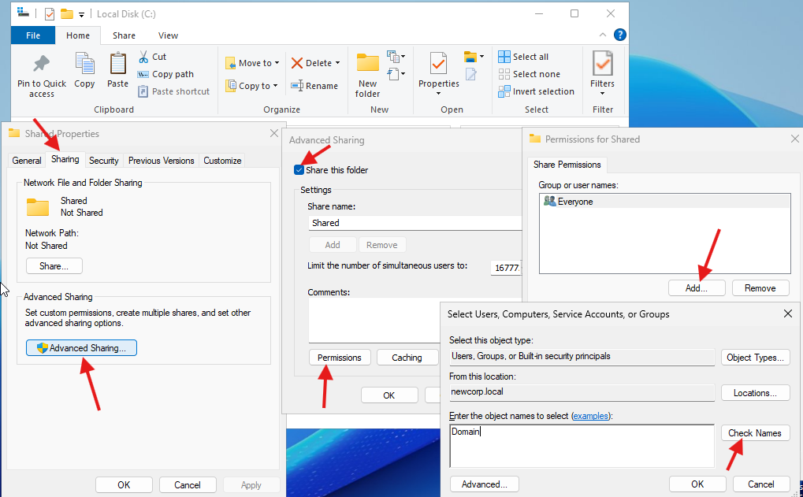

# Configuring our File Server (FS01)

Owner: JECS2025

---

## 🗂️ Contents
1. [Set Static IP](#1-set-static-ip---17216020)
2. [Rename the Computer](#2-rename-the-computer-to-newcorp-fs01)
3. [Join FS01 to the Domain](#3-join-fs01-to-the-domain)
4. [Install File Server Role](#4-install-file-server-role)
5. [Create Shared Folder](#5-create-shared-folder)

---

## Configure our File Server (FS01)

### 1. Set Static IP - 172.16.0.20

*Make sure the Default Gateway & Preferred DNS Server is the DC’s Internal IP address. This is because DC01 serves as the gateway for the internal network.*

---

### 2. Rename the Computer to NewCorp-FS01

---

### 3. Join FS01 to the Domain

- Go to the same place you renamed the computer.
- Choose **Member of: Domain** → Enter `newcorp.local`.
- Provide **Domain Admin credentials**.

- Restart FS01.

---

### 4. Install File Server Role

- Open **Server Manager** → **Add Roles and Features**.
- Select **File and Storage Services** → **File Server** → Install.

---

### 5. Create Shared Folder

- Create `C:\Shared` folder.

- Right-click folder → **Properties** → **Sharing**
- Click **Advanced Sharing** → **Share this folder**
- Set **permissions** (e.g., Domain Users: Read/Write)

- Test access from `NewCorp-WS01` and `DC01` *(WS01 yet to be configured)*.
