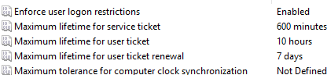

# Essential Group Policy Setup

Owner: JECS2025

---

## 📂 Contents
1. [Create and Link GPO](#1-create-and-link-gpo)
2. [Password Policy](#2-password-policy)
3. [Account Lockout Policy](#3-account-lockout-policy)
4. [Audit Policy](#4-audit-policy)
5. [Kerberos Policy](#5-kerberos-policy)
6. [Security Options](#6-security-options)
7. [Block Command Execution](#7-block-command-execution)
8. [Apply and Verify GPO](#8-apply-and-verify-gpo)

---

## 1. Create and Link GPO
1. Open **Group Policy Management Console (GPMC)** on DC01.
2. Create a **New GPO**: `Baseline Policy` linked to the domain.

---

## 2. Password Policy
- **Purpose**: Basic password security enforcement
- Settings:
    - Enforce Password History: 24 passwords remembered
    - Maximum Password Age: 60-90 days
    - Minimum Password Age: 1 day
    - Minimum Password Length: 14 characters
    - Password Complexity: Enabled
    - Store Passwords Using Reversible Encryption: Disabled

```bash
Computer Configuration > Policies > Windows Settings > Security Settings > Account Policies > Password Policy
```

---

## 3. Account Lockout Policy
- **Purpose**: Prevent brute force attacks
- Settings:
    - Account Lockout Threshold: 5 invalid login attempts
    - Account Lockout Duration: 15 minutes
    - Reset Account Lockout Counter After: 15 minutes

```bash
Computer Configuration > Policies > Windows Settings > Security Settings > Account Policies > Account Lockout Policy
```

---

## 4. Audit Policy
- **Purpose**: Enable logging for security events
- Settings:
    - Audit Logon Events: Success and Failure
    - Audit Object Access: Success and Failure
    - Audit Directory Service Access: Success and Failure
    - Audit Privilege Use: Success and Failure
    - Audit Process Tracking: Success and Failure
    - Audit System Events: Success and Failure

```bash
Computer Configuration > Policies > Windows Settings > Security Settings > Advanced Audit Policy Configuration > Logon/Logoff, Object Access, Privilege Use
```

---

## 5. Kerberos Policy
- **Purpose**: Secure authentication within AD



```bash
Computer Configuration > Policies > Windows Settings > Security Settings > Kerberos Policy
```

---

## 6. Security Options
- **Purpose**: Additional system hardening
- Settings:
    - Accounts: Guest account status: Disabled
    - Accounts: Limit local account use of blank passwords to console logon only: Enabled
    - User Account Control: Detect application installations and prompt for elevation: Enabled

```bash
Computer Configuration > Policies > Windows Settings > Security Settings > Local Policies > Security Options
```

---

## 7. Block Command Execution
- **Prevent CMD**:
    - Policy: Prevent access to the command prompt
    - Path: `User Configuration > Administrative Templates > System`

- **Prevent PowerShell**:
    - Policy: Don't run specified Windows applications (add `powershell.exe`)
    - Path: `User Configuration > Administrative Templates > System`

- **Disable PowerShell Scripts**:
    - Policy: Turn on Script Execution → Disabled
    - Path: `Computer Configuration > Administrative Templates > Windows Components > Windows PowerShell`

- **Prevent PowerShell ISE**:
    - Policy: Don't run specified Windows applications (add `powershell_ise.exe`)
    - Path: `User Configuration > Administrative Templates > System`

- **Prevent Registry Edits**:
    - Policy: Prevent access to registry editing tools
    - Path: `User Configuration > Administrative Templates > System`

---

## 8. Apply and Verify GPO
- Force GPO Update:
```powershell
gpupdate /force
```

- Verify Policy Application:
```powershell
rsop.msc
gpresult /r
```

This GPO setup ensures **baseline security hardening**, **event auditing**, and **restricted access** to sensitive system tools across domain-joined workstations.
