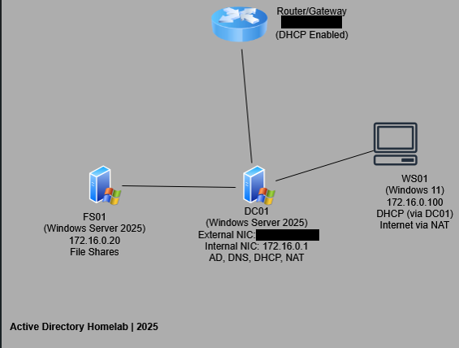

# Homelabs

This repository documents the setup, configuration, and maintenance of my homelab environment.

I'll keep this short; the whole idea behind this project is to demonstrate my appetite for learning new things and applying them to simulated real-world environments. I plan to build each homelab iteration on top of the previous one, expanding in a progressive manner.

---

## 🔧 How I Plan for It to Go

- **Phase 1:** AD Setup & Basic Config  
- **Phase 2:** Firewalls & Network Segmentation  
- **Phase 3:** SIEM Setup (Splunk, Wazuh, ELK)  
- **Phase 4:** Honeypot Creation & Deployment  
- **Phase 5:** Attack Simulations & Incident Response 🔥

---

## 🧪 Lab Environment

| **Role** | VM | **OS / Specs** |
| --- | --- | --- |
| ✅ **Domain Controller (DC01)** | VMWare Workstation Pro | Windows Server 2025, 4GB RAM |
| ✅ **Windows File Server (FS01)** | VMWare Workstation Pro | Windows Server 2025, 2GB RAM |
| ✅ **Windows 11 Client (WS01)** *(Testing policies & logins)* | VMWare Workstation Pro | Windows 11, 4GB RAM |

---

## 🛠️ Key Setup Steps

- ✅ Install **Windows Server 2022** in VMware and configure **Active Directory**.
- ✅ Deploy **Windows clients** and **join them to the domain**.
- ✅ **Test domain authentication** from Windows clients.

---

## 🖥️ Topology Overview

---

This project showcases a fully functional **Active Directory (AD) homelab**, designed to simulate a real-world enterprise environment. The lab consists of:

- **DC01 (Domain Controller)** – Handles **Active Directory, DNS, DHCP, and NAT**. Configured with **dual NICs** to route internal traffic while providing internet access via NAT.
- **FS01 (File Server)** – A dedicated Windows Server 2025 machine for **file sharing and network storage**.
- **WS01 (Windows 11 Workstation)** – A client machine that **obtains an IP dynamically from DC01 DHCP server** and connects to the internet through NAT.
- **Router/Gateway** – Provides external network access and acts as the **primary DHCP server for external devices**.

---

This setup demonstrates my ability to **design, configure, and manage enterprise IT infrastructure**, including **Active Directory, networking, and NAT routing**.

---

## 📂 Table of Contents

1. 🖥️ [Prerequisite & Configuring our DC (DC01)](./DC01_Config.md)
2. 📁 [Configuring our File Server (FS01)](./FS01_Config.md)
3. 🖥️ [Configuring Our Workstation (WS01)](./WS01_Config.md)
4. 🌐 [Router/Gateway Configuration](./Router_Config.md)
5. 🛡️ [Essential Group Policy Setup](./GroupPolicy.md)
6. 📊 [Security & Logging Setup](./Security_Logging.md)
