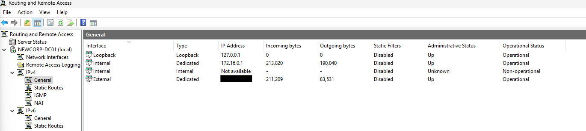
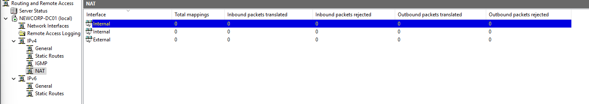

# Router/Gateway Configuration

Owner: WhiskeyTangoFoxtrot

---

## 📂 Contents
1. [Network Setup Overview](#1-network-setup-overview)
2. [Enable Routing/NAT on DC01](#2-enable-routingnat-on-dc01)
3. [Verify Internet Access](#3-verify-internet-access)

---

## 1. Network Setup Overview

This router configuration ensures that internal virtual machines (FS01, WS01) can access external networks via **DC01** acting as a NAT-enabled gateway. This setup isolates the internal network while providing **secure outbound internet access**.

Ensure **VM network connections** are correct:
- **DC01**: Dual NICs  
  - External: `External NIC IP`  
  - Internal: `172.16.0.1`
- **FS01** and **WS01**: Connect to internal network `172.16.0.x`

---

## 2. Enable Routing/NAT on DC01

Install **Routing and Remote Access (RRAS)** role to enable NAT routing for internal clients.

*RRAS acts as a software router, providing routing services within LAN/WAN environments and managing secure internet access via NAT.*

### 🚀 Steps:
1. Open **Server Manager on DC01**  
2. Click **Add Roles and Features**
3. Wizard:
   - Click **Next** on "Before You Begin"
   - Select **Role-based or feature-based installation** → Next
4. Select **DC01** server → Next
5. Roles:
   - Select **Remote Access** → Next
6. Features:
   - Leave defaults → Next
7. Role Services:
   - Select **Routing / DirectAccess and VPN** → Next
8. Click **Install** and wait for completion



Ensure internal and external NICs are detected and active.

---

### 🌐 Configure NAT:

- In **Routing and Remote Access** → **IPv4** → **NAT**
- Right-click **NAT** → **New Interface** → Select **External** → OK
- Set interface as **Public Interface connected to the Internet**
- Enable **NAT** on this interface

**Enable NAT for Internal Network:**
- Right-click **Internal (172.16.0.1)** → **Properties**
- Set as **Private Network** → Apply changes



Both **Public (External)** and **Private (Internal)** interfaces should now appear in **NAT**, enabling internal network traffic to route externally via **DC01**.

---

## 3. Verify Internet Access

From **WS01**, confirm internet connectivity through DC01 NAT:

### 🔌 Command Validation:
```powershell
ipconfig /all
ping 8.8.8.8
tracert 8.8.8.8
```
*Expected:* Traffic routes through `172.16.0.1`, confirming NAT functionality.

> 🔹 **Why 8.8.8.8?**  
Google’s public DNS server (8.8.8.8) is used here to confirm external network access. It is a reliable IP to test outbound connectivity and validate NAT routing, regardless of our DNS configuration.

This setup ensures internal clients can securely access external networks while maintaining an isolated lab environment.
