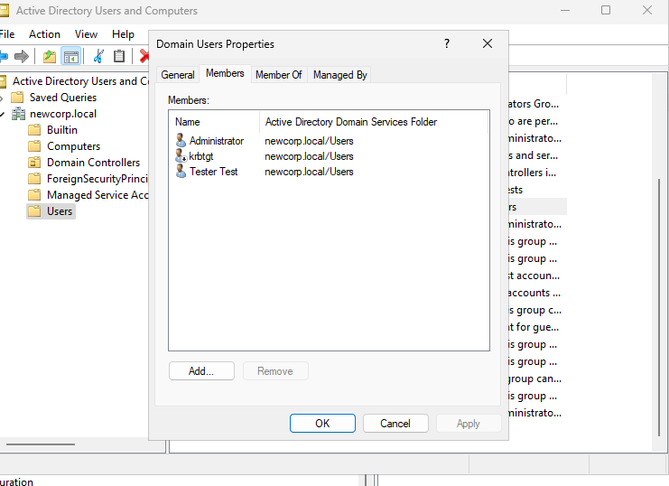
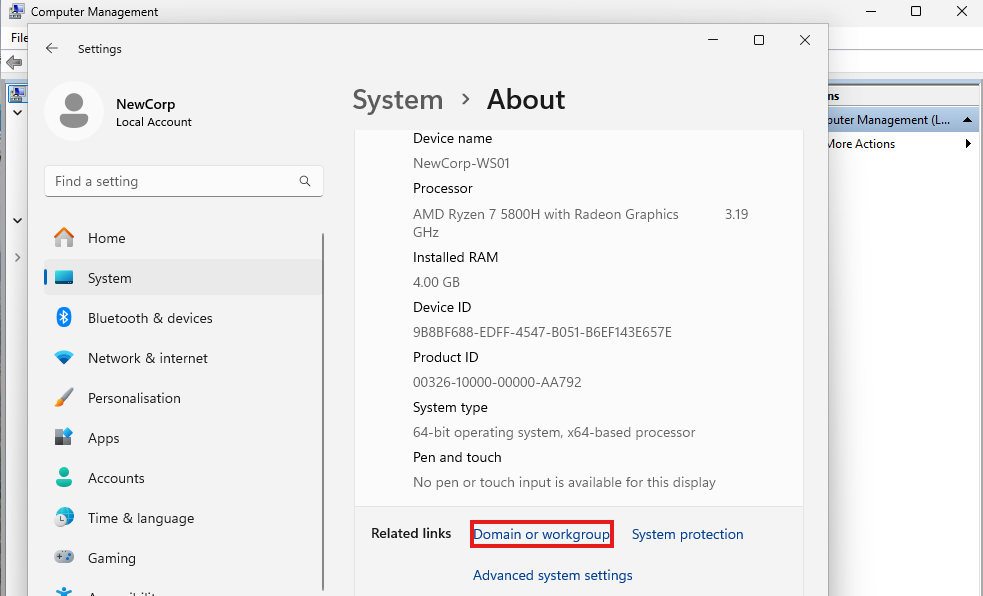

# Configuring Our Workstation (WS01)

Owner: JECS2025

---

## 📂 Contents
1. [Join the Domain & Configure DNS](#1-join-the-domain--configure-dns)
2. [Verify Domain User Login](#2-verify-domain-user-login)
3. [Test Network Access](#3-test-network-access)

---

## 1. Join the Domain & Configure DNS

- Set IP to **DHCP (via DC01)**.
- Go to: Settings > System > About


- Select **Domain** → Enter `newcorp.local`.
- Provide **Domain Admin credentials**.
- Restart WS01.

---

## 2. Verify Domain User Login

- Login as a domain user (e.g., `testuser@newcorp.local`)

  


*I’ll be using ‘Tester Test’ as the account that’ll verify all my future security implementations work.*

### 🧹 Command Check:
```powershell
whoami
```
*Expected Output:*  
`newcorp\testuser`

---

## 3. Test Network Access

### 🔌 Ping Domain Controller:
```powershell
ping 172.16.0.1
```

### 🔌 Ping File Server:
```powershell
ping 172.16.0.20
```

### 📂 Access Shared Folder:
```powershell
\\NewCorp-FS01\Shared
```
> *Paste into File Explorer address bar or use `net use` in CMD/Powershell.*

### 🧹 Optional File Access via CMD:
```powershell
net use \\NewCorp-FS01\Shared
```

*Confirm that FS01’s shared folder is reachable and read/write capable.*
