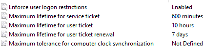

# Essential Group Policy Setup

Owner: WhiskeyTangoFoxtrot

1. Open **Group Policy Management Console (GPMC)** on DC01.
2. Create a **New GPO**: `Baseline Policy` linked to the domain.
3. Configure the following:
    - **Password Policy** (Basic Security)
        - **Enforce Password History**: 24 passwords remembered
        - **Maximum Password Age**: 60-90 days
        - **Minimum Password Age**: 1 day
        - **Minimum Password Length**: 14 characters (strong password requirement)
        - **Password Complexity**: Enabled (require uppercase, lowercase, digits, and symbols)
        - **Store Passwords Using Reversible Encryption**: Disabled
        
        ```bash
        Computer Configuration > Policies > Windows Settings > Security Settings > Account Policies > Password Policy
        ```
        
    - **Account Lockout Policy** (Protection from brute force attacks)
        - **Account Lockout Threshold**: 5 invalid login attempts
        - **Account Lockout Duration**: 15 minutes
        - **Reset Account Lockout Counter After**: 15 minutes
        
        ```bash
        Computer Configuration > Policies > Windows Settings > Security Settings > Account Policies > Account Lockout Policy
        ```
        
    - **Audit Policy** (Enable Logging)
        - **Audit Logon Events**: Success and Failure
        - **Audit Object Access**: Success and Failure
        - **Audit Directory Service Access**: Success and Failure
        - **Audit Privilege Use**: Success and Failure
        - **Audit Process Tracking**: Success and Failure
        - **Audit System Events**: Success and Failure
    
    ```bash
    Computer Configuration > Policies > Windows Settings > Security Settings > Advanced Audit Policy Configuration > Logon/Logoff, Object Access, Privilege Use
    ```
    
- **Kerberos Policies (secure authentication process in AD):**
    
    
    

```bash
Computer Configuration > Policies > Windows Settings > Security Settings > Kerberos Policy
```

- **Security Options** (Additional hardening)
    - **Accounts: Guest account status**: Disabled (disable the Guest account)
    - **Accounts: Limit local account use of blank passwords to console logon only**: Enabled
    - **User Account Control: Detect application installations and prompt for elevation**: Enabled
    
    ```bash
    Computer Configuration > Policies > Windows Settings > Security Settings > Local Policies > Security Options
    ```
    
    1. **Block Commands Execution:**
        - **Command Prompt (CMD)**:
            - **Policy Setting**: "Prevent access to the command prompt"
            - **Where to Configure**: `User Configuration > Administrative Templates > System`
        - **PowerShell**:
            - **Policy Setting**: "Don't run specified Windows applications" (add `powershell.exe`)
            - **Where to Configure**: `User Configuration > Administrative Templates > System`
        - **PowerShell Scripts**:
            - **Policy Setting**: "Turn on Script Execution" set to **Disabled**
            - **Where to Configure**: `Computer Configuration > Administrative Templates > Windows Components > Windows PowerShell`
        - **PowerShell ISE**:
            - **Policy Setting**: "Don't run specified Windows applications" (add `powershell_ise.exe`)
            - **Where to Configure**: `User Configuration > Administrative Templates > System`
        - **Registry Editing Tools**:
            - **Policy Setting**: "Prevent access to registry editing tools"
            - **Where to Configure**: `User Configuration > Administrative Templates > System`
1. **Apply GPOs**:
    - Force update: Run `gpupdate /force` on WS01.
    - Verify policies via `rsop.msc` or `gpresult /r`.